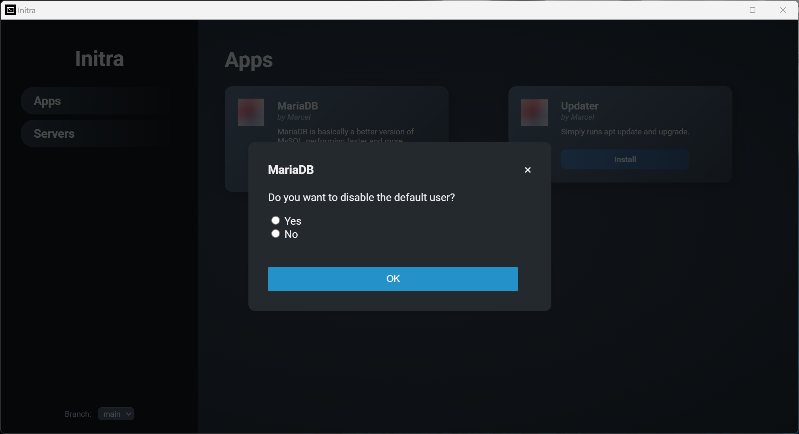

# Creating Apps

To create or add your own app, you'll need to create an app folder, like `update`. In this folder you'll need two files: `app.json` and `install.sh`.

> [!NOTE]
>
> In the future its planned to automate this with a setup wizard

> [!IMPORTANT]
>
> The folder name, in this case `update` will act like a unique id! Its how your app/package is found and needs to be unique!

The `app.json` file is responsible for listing your app/package inside Initra. The `install.sh` file is what's being downloaded and executed on the linux machine via SSH.

------

## Basic app.json

```json
{
  "id": "update",
  "title": "Updater",
  "description": "Simply runs apt update and upgrade.",
  "image": "",
  "author": "Marcel",
  "github": null,
  "created": null,
  "updated": null,
  "dependencies": [
  ],
  "args": {
  }
}
```

> [!NOTE]
>
> `github`, `created` and `updated` are currently **not** implemented.

> [!IMPORTANT]
>
> The `id` field needs to be identical with your folder name!

------

## Basic install.sh

The following script comes with a small helper function to parse the arguments you'll receive from Initra, given you've setup your `app.json` with arguments.

```bash
#!/bin/bash

# helper to get args by name
getArg() {
  local key="$1"
  shift
  while [[ $# -gt 0 ]]; do
    case "$1" in
      -$key|--$key)
        echo "$2"
        return 0
        ;;
    esac
    shift
  done
  return 1
}

# set the name as variable
NAME="$(getArg "name" "$@")"

# check if null
if [[ -z "$NAME" ]]; then
  echo "Missing Parameter -name"
  exit 1
fi

# something with it. this is just an example app!
# because of that we dont need any arguments here
# but the code is left in for examples.
# echo "Hello $NAME"

# this is where you do your install logic
sudo apt update -y
sudo apt upgrade -y

# these lines are a must-have. without it, initra doesnt know
# if the installation is done and if it should close the connection.
echo "initra://install/done"
echo "initra://ssh/close"
```

------

## App arguments

Arguments can be used to show prompts and get user input **before** the `install.sh` is being executed. These arguments are parsed and then used to run the install script. This would result in a screen like below.

Currently supported argument types are: `string`, `number`, `boolean` and `password`.

> [!IMPORTANT]
>
> Argument names need to be unique.



The install script would be launched like below, given the user selected `Yes`.

```bash
bash install.sh -name true
```

```json
{
  "id": "update",
  "title": "Updater",
  "description": "Simply runs apt update and upgrade.",
  "image": "",
  "author": "Marcel",
  "github": null,
  "created": null,
  "updated": null,
  "dependencies": [
  ],
  "args": {
    "name": {
      "title": "MariaDB",
      "text": "Do you want to disable the default user?",
      "type": "boolean"
    }
  }
}
```

The argument name being passed is based on how it is defined in the `app.json` file. In this case, its defined as `name`. hence the parameter name `-name `.

```json
"name": {
    "title": "MariaDB",
    "text": "Do you want to disable the default user?",
    "type": "boolean"
}
```

------

## Multiple Arguments

You can have multiple arguments like in the following example:

```json
"disableMariaDbDefaultUser": {
    "title": "MariaDB",
    "text": "Do you want to disable the default user?",
    "type": "boolean"
},
"removeTestDatabase": {
    "title": "MariaDB",
    "text": "Do you want to remove the test database?",
    "type": "boolean"
}
```

This would result in the install script being executed like this, given the user chose yes every time.

```bash
bash install.sh -disableMariaDbDefaultUser true -removeTestDatabase true
```

### Complete Multi-Argument Example

```json
{
  "id": "update",
  "title": "Updater",
  "description": "Simply runs apt update and upgrade.",
  "image": "",
  "author": "Marcel",
  "github": null,
  "created": null,
  "updated": null,
  "dependencies": [
  ],
  "args": {
    "disableMariaDbDefaultUser": {
        "title": "MariaDB",
        "text": "Do you want to disable the default user?",
        "type": "boolean"
    },
    "removeTestDatabase": {
        "title": "MariaDB",
        "text": "Do you want to remove the test database?",
        "type": "boolean"
    }
  }
}
```

