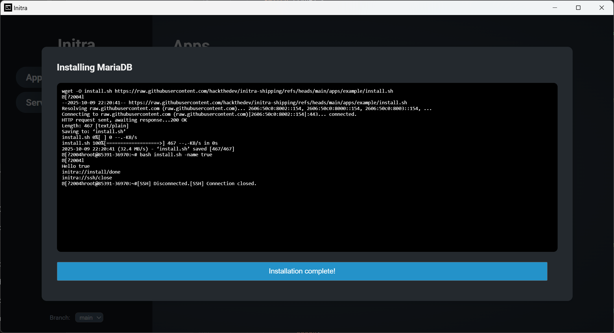
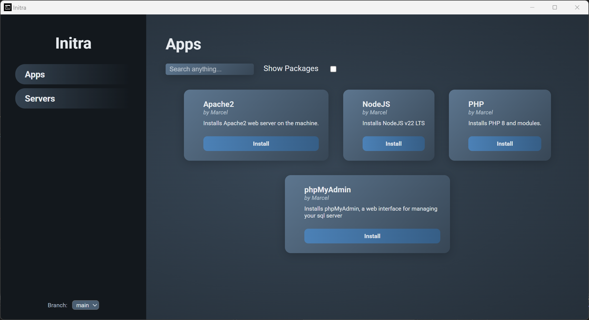
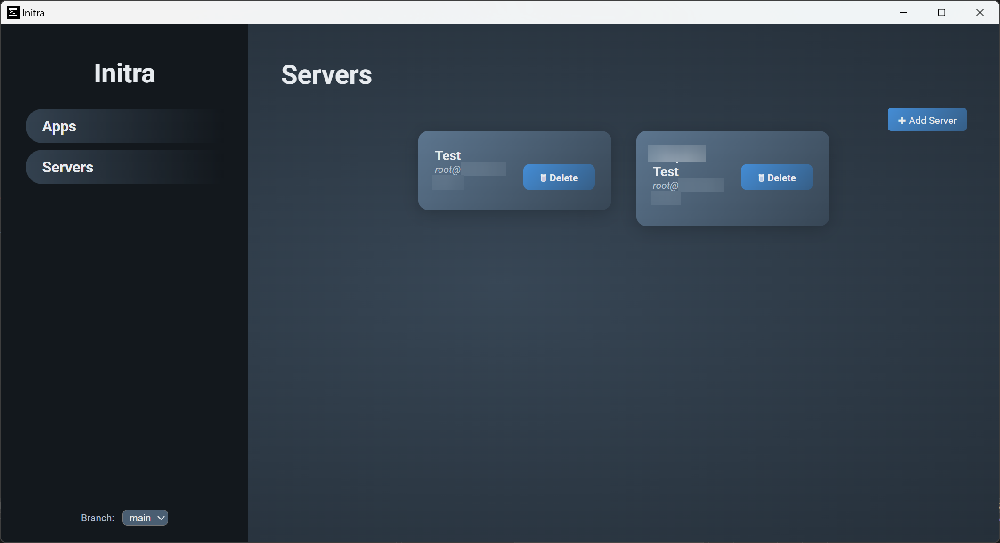

# Initra

```
>_ Interactive SSH App Installer for Linux  
>_ Create your own software packages with dependencies and live terminal feedback.
```

[](https://ko-fi.com/M4M719FPNG)

------

## Introduction

Initra is an application meant to help users to install software via SSH on a linux system in an interactive way. Apps or Package can have dependencies that will be installed automatically as well. This means that if you make your own install script about an app that requires MariaDB to be installed, you can add it as dependency and it'll install that as well without you having to deal with it.

------

## Idea

The idea of Initra was born from the need to provide an easy way of installing multiple different software projects for users that may not be that familiar with linux. While it was intended to be used for a custom ecosystem of software projects i plan to create it can install and setup any software as it uses a .sh bash script to install software.

Basically it would make it compatible with any auto installer script that uses `.sh` files to install things.

------

## Interactive Inputs

Apps/Packages can define arguments in their `app.json` file. When a user tries to install an app that has arguments defined, it'll prompt the user based on the values needed. 


> [!Note]
>
> If you want to learn more about arguments and how to create them, checkout `Creating Apps.md`
>

------

## Terminal Output

Users can watch dependencies and apps being installed in real time as the terminal output is being displayed during installation. Once the installation is done it'll show a button indicating it.



------

## Screenshots

### Apps



### Servers



------

## Roadmap

- [ ] Add App/Package Creation Wizard
- [ ] Add Github Rate Limit Handling on UI
- [x] Add Search Bar for Apps (and maybe servers)
- [ ] Add default options feature to prompts
