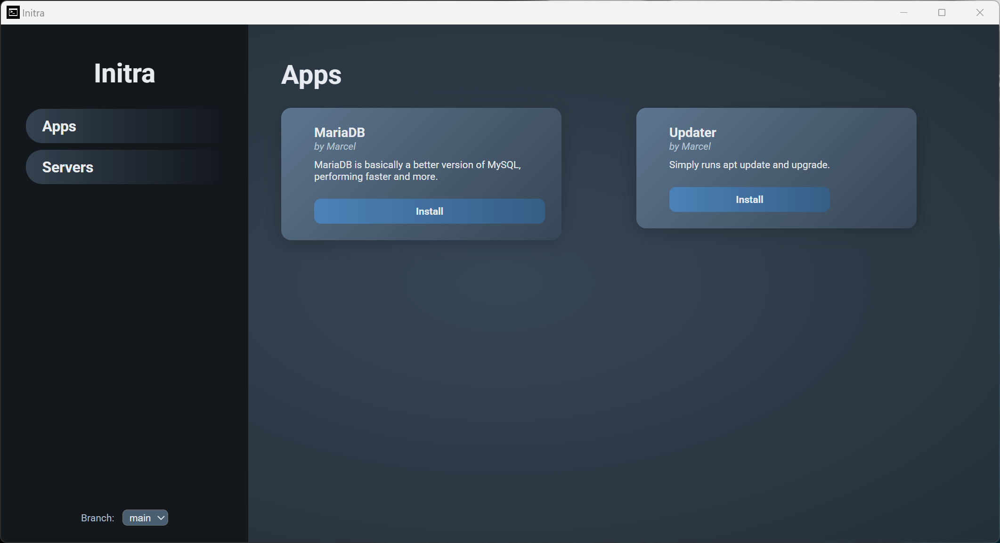
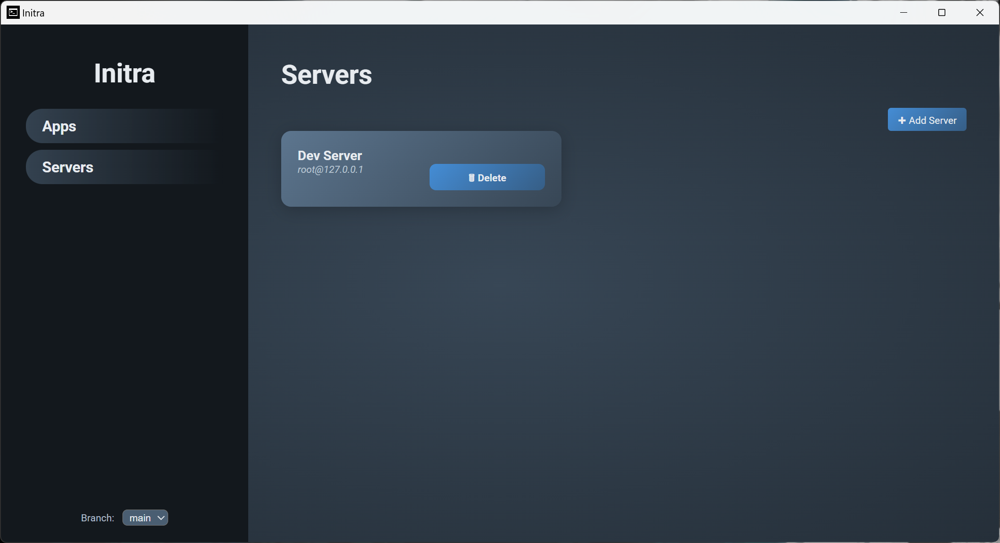

# Initra

```
>_ Interactive SSH App Installer for Linux  
>_ Create your own software packages with dependencies and live terminal feedback.
```

[](https://ko-fi.com/M4M719FPNG)

[TOC]

------

## Introduction

Initra is an application meant to help users to install software via SSH on a linux system in an interactive way. Apps or Package can have dependencies that will be installed automatically as well. This means that if you make your own install script about an app that requires MariaDB to be installed, you can add it as dependency and it'll install that as well without you having to deal with it.

------

## Idea

The idea of Initra was born from the need to provide an easy way of installing multiple different software projects for users that way not be that familiar with linux. While it was intended to be used for a custom ecosystem of software projects i plan to create it can install and setup any software as it uses a .sh bash script to install software.

Basically it would make it compatible with any auto installer script that uses `.sh` files to install things.

------

## Interactive Inputs

Apps/Packages can define arguments in their `app.json` file. When a user tries to install an app that has arguments defined, it'll prompt the user based on the values needed. 


```json
{
  "id": "mariadb",
  "title": "MariaDB",
  "description": "MariaDB is basically a better version of MySQL, performing faster and more.",
  "image": "",
  "author": "Marcel",
  "github": null,
  "created": null,
  "updated": null,
  "dependencies": [
    "update"
  ],
  "args": {
    "name": {
      "title": "MariaDB",
      "text": "Do you want to disable the default user?",
      "type": "boolean"
    }
  }
}
```

Currently supported args types are:

- string
- number
- boolean
- password

If none is supplied it will fallback to text *(aka string)*.

> [!IMPORTANT]
>
> The `name` is going to be name of the parameter that'll be passed to your `install.sh` script! If you want the parameter to be named differently, rename it.
>
> Otherwise it'll be passed to your script as `install.sh -name <value here>`-
>
> ```json
> "name": {
>     "title": "MariaDB",
>     "text": "Do you want to disable the default user?",
>     "type": "boolean"
> }
> ```

------

## Add your own apps/packages

To create or add your own app, you'll need create an app folder, like `update`. In this folder you'll need two files: `app.json` and `install.sh`.

> [!IMPORTANT]
>
> The folder name, in this case `update` will act like a unique id! Its how your package is found and needs to be unique!

The `app.json` file is responsible for listing your app/package inside Initra. The `install.sh` file is what's being downloaded and executed on the linux machine via SSH.

### Basic app.json

```json
{
  "id": "update",
  "title": "Updater",
  "description": "Simply runs apt update and upgrade.",
  "image": "",
  "author": "Marcel",
  "github": null,
  "created": null,
  "updated": null,
  "dependencies": [
  ],
  "args": {
  }
}
```

> [!NOTE]
>
> `github`, `created` and `updated` are currently **not** implemented.

> [!IMPORTANT]
>
> The `id` field needs to be identical with your folder name!

### Basic install.sh

The following script comes with a small helper function to parse the arguments you'll receive from Initra, given you've setup your `app.json` with arguments.

```sh
#!/bin/bash

# helper to get args by name
getArg() {
  local key="$1"
  shift
  while [[ $# -gt 0 ]]; do
    case "$1" in
      -$key|--$key)
        echo "$2"
        return 0
        ;;
    esac
    shift
  done
  return 1
}

# set the name as variable
NAME="$(getArg "name" "$@")"

# check if null
if [[ -z "$NAME" ]]; then
  echo "Missing Parameter -name"
  exit 1
fi

# something with it. this is just an example app!
# because of that we dont need any arguments here
# but the code is left in for examples.
# echo "Hello $NAME"

# this is where you do your install logic
sudo apt update -y
sudo apt upgrade -y

# these lines are a must-have. without it, initra doesnt know
# if the installation is done and if it should close the connection.
echo "initra://install/done"
echo "initra://ssh/close"
```

------

## Terminal Output

Users can watch dependencies and apps being installed in real time as the terminal output is being displayed during installation. Once the installation is done it'll show a button indicating it.


------

## Screenshots

### Apps



### Servers



------

## Road map

- [ ] Add App/Package Creation Wizard
- [ ] Add Github Rate Limit Handling on UI
- [ ] Add Search Bar for Apps (and maybe servers)
